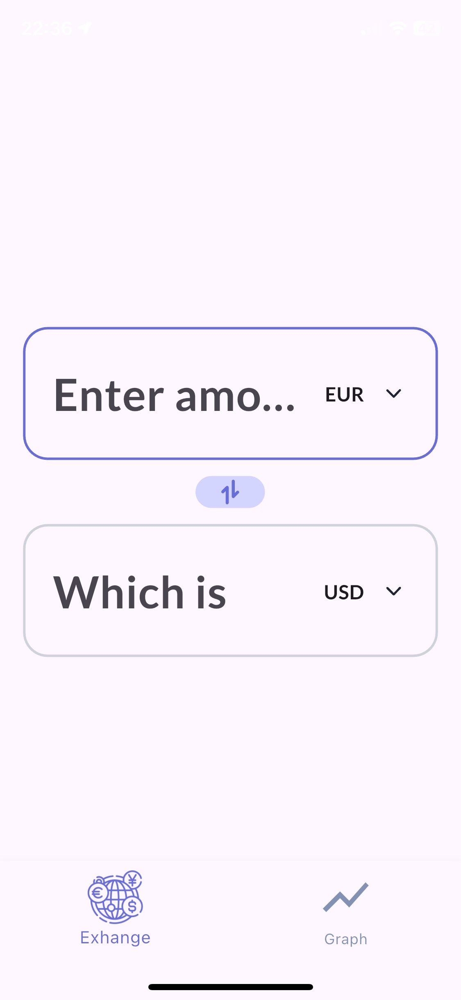
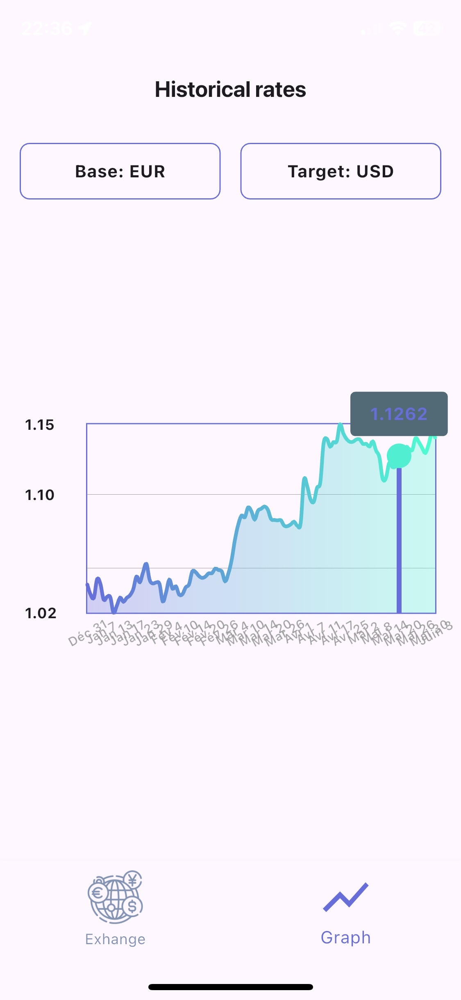

# 💱 Currency Exchange App

A modern Flutter application for currency conversion and historical rate visualization, built as part of an internship learning project.

## 📸 Screenshots

<div align="center">
  
  

*Real-time currency converter with instant calculations Interactive historical charts with customizable currency pairs*

</div>

## 📱 Overview

This comprehensive currency exchange app provides real-time currency conversion and historical rate analysis with a beautiful, intuitive interface. The app features two main sections: a converter for instant calculations and a graph view for historical trends.

## ✨ Features

### 🔄 Currency Converter
- **Real-time conversion** between 150+ major currencies (USD, EUR, GBP, JPY, AUD, CAD, CHF, CNY, SEK, NZD, TRY)
- **Instant calculations** as you type
- **Currency swap function** with animated button
- **Bottom sheet selection** for easy currency picking
- **Clean, responsive design** with custom input fields

### 📊 Historical Charts
- **Interactive line charts** showing currency rate evolution over time
- **Customizable currency pairs** - select any base and target currency
- **Professional styling** with gradients and smooth curves
- **Smart date labeling** with rotated, evenly-spaced dates
- **Configurable grid** for precise value reading
- **Loading states** during data fetching

### 🎨 UI/UX Design
- **Bottom navigation** between converter and chart views
- **Custom styled components** with consistent branding
- **Responsive layout** that adapts to different screen sizes
- **Smooth animations** and transitions
- **Color-coded interface** with purple gradient theme

## 🛠️ Technical Implementation

### APIs Used
- **RapidAPI Currency Exchange** for real-time rates
- **Frankfurter API** for historical data (free, no API key required)

### Key Dependencies
- `fl_chart` - Beautiful chart visualizations
- `http` - API communication
- `google_fonts` - Typography (Lato font)
- `flutter_svg` - Vector icons and graphics

### Architecture
- **StatefulWidget management** for reactive UI
- **Separate service layer** for API calls
- **Reusable widget components** (input fields, selection sheets)
- **Clean separation** between converter and chart functionality

## 🔧 Code Highlights

### Smart Data Handling
- Null-safe API response parsing
- Error handling for failed requests
- Loading states during data fetching
- Dynamic currency list management

### Chart Customization
- Configurable grid intervals for optimal readability
- Intelligent date spacing (every 2-4 dates depending on range)
- Custom title widgets with proper formatting
- Responsive aspect ratios and padding

### Reusable Components
- `CurrencySelectionSheet` - Modal bottom sheet for currency picking
- `AmountInputField` & `ResultField` - Custom styled input components
- Shared styling and theming across components

## 📚 Learning Outcomes

This project served as a comprehensive introduction to Flutter development, covering:

- **Flutter fundamentals** - Widgets, state management, navigation
- **API integration** - HTTP requests, JSON parsing, error handling
- **Custom UI components** - Building reusable, styled widgets
- **Chart implementation** - Data visualization with fl_chart
- **Responsive design** - Creating layouts that work on various screen sizes
- **Dart language** - Syntax, null safety, async programming

## 🚀 Getting Started

### Prerequisites
- Flutter SDK (3.7.2+)
- Dart SDK
- Android Studio / VS Code
- API key for RapidAPI (currency conversion service)

### Installation

1. **Clone the repository**
   ```bash
   git clone [repository-url]
   cd my_flutter_currency_app
   ```

2. **Install dependencies**
   ```bash
   flutter pub get
   ```

3. **Add API credentials**
   Create `lib/secrets.dart`:
   ```dart
   const String apiKey = 'your_rapidapi_key_here';
   ```

4. **Run the application**
   ```bash
   flutter run
   ```

## 🎯 Future Enhancements

- Add more currency pairs and exotic currencies
- Implement offline caching for better performance
- Add currency rate alerts and notifications
- Include more chart types (candlestick, volume indicators)
- Add dark/light theme toggle
- Implement currency rate predictions

## 👨‍💻 Development Notes

This project was developed as part of an internship learning experience to master Flutter and Dart. The focus was on creating a production-ready app with clean code, proper architecture, and professional UI/UX design.

**Key Learning Areas:**
- Modern Flutter development practices
- API integration and data management
- Custom widget creation and styling  
- Chart libraries and data visualization
- Responsive design principles
